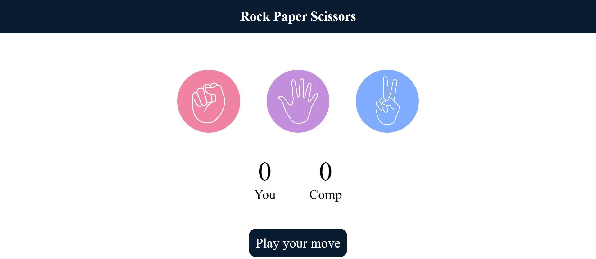

# Rock Paper Scissors Game

This is a fully functional and responsive Rock Paper Scissors game that allows players to compete against the computer. Built with a focus on user experience, the game features interactive elements and smooth animations. It is implemented using clean coding principles, making it easy to understand and extend.

## Live Demo

The game is hosted live on Netlify. You can play it here: [Rock Paper Scissors Game](https://your-netlify-url.com)

## Features

- **Responsive Design**: The game adapts seamlessly to various screen sizes, ensuring an enjoyable experience on mobile and desktop.
- **Interactive Gameplay**: Players can choose their moves, and the game provides instant feedback on the results.
- **Smooth Animations**: Enhances user interaction and makes the game more engaging.
- **Core Technologies**: Built using HTML, CSS, and JavaScript, with no frameworks used.

## Technologies Used

- **HTML5**: Structure and layout of the game interface.
- **CSS3**: Styling and responsive design.
- **JavaScript**: Handles game logic and interactivity.

## Installation

To run the project locally:

1. Clone the repository:
   git clone https://github.com/your-username/rock-paper-scissors.git

## Contributions

If you’d like to contribute, feel free to fork the repository and submit a pull request. You can also open an issue for any bugs or feature requests.

## License

This project is licensed under the MIT License - see the [LICENSE](LICENSE) file for details.
